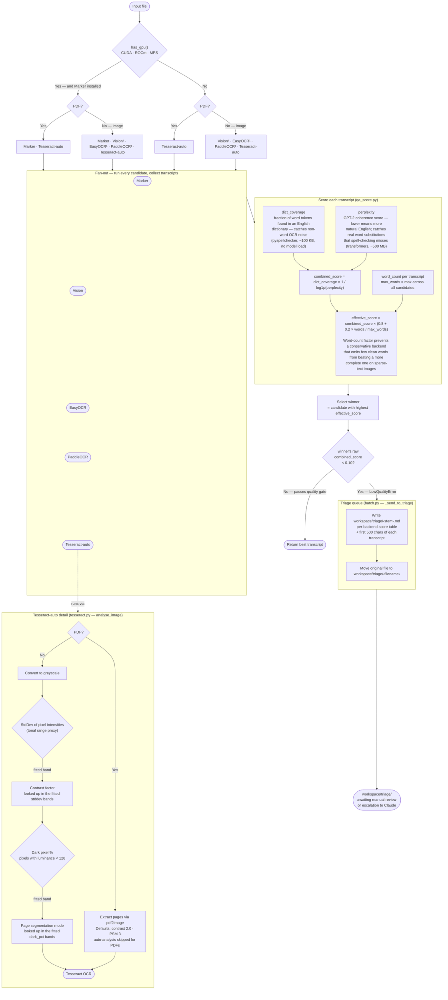

One strategy over the whole set of local engines, for when you would rather not
choose a backend per document.

`auto-local` runs every viable local engine on a file, scores each transcript
with a reference-free quality score, and keeps the best. It averages 0.66/0.65
on the seventeen-fixture corpus, behind PaddleOCR-VL (0.72/0.66) and Vision
(0.67/0.68), and it is among the most expensive, since it runs several engines
per file.


An oracle picking the best local engine for each file would average 0.79;
`auto-local` reaches 0.66 — about 83% of the ceiling. Most of the gap is
PaddleOCR-VL, which is not in the default pool and joins only with
`--with-paddle-vl`. See
[results](../research/in-depth/#fan-out-no-longer-wins).


The engines run one after another, not in parallel. Each is individually
heavy on CPU and RAM and several hold model singletons; starting two or
three at once risks memory pressure and contention that makes runtimes less
predictable, which hurts most on exactly the large batches where the time
would be worth saving. If it is too slow, name a single cheap engine —
`tesseract-auto` measures better than fan-out's runtime suggests, and
`--quality-gate` routes its failures to the same triage queue.

The decision table below is implemented in `tetrak_ocr.auto_local` and
asserted, case by case, in `tests/test_auto_local.py`. Every eligible candidate
runs; the order settles ties.

One candidate is not in the table because it is not in the pool unless you
ask. `--with-paddle-vl` adds [PaddleOCR-VL](../engines/#paddleocr-vl) to
every branch below, images and PDFs alike, and ranks it first. It measures
as the strongest local engine on the corpus and wins the registers this pool
reads worst, but it runs in minutes where the rest run in seconds — and
fan-out pays that cost on every file, so it is a choice rather than a
default.

Decision logic for `tetrak_ocr.auto_local`, `tetrak_ocr.qa_score`, and the triage queue in `tetrak_ocr.batch`.

¹ Vision, EasyOCR and PaddleOCR are excluded from PDF candidates — none of them reads PDFs. Vision is additionally macOS-only, so off macOS it never appears as a candidate at all.

Candidates are ordered by measured result, because fast mode takes the first
and fan-out uses the order to break ties. EasyOCR sits above PaddleOCR: it is
ahead on every image where either engine reads anything at all. See
[results](../research/in-depth/#the-results) for the scores.

---

## Notes

### GPU detection (`has_gpu()`)

Uses PyTorch, which is already installed as a transitive dependency:
- `torch.cuda.is_available()` — covers NVIDIA CUDA and AMD ROCm (ROCm exposes the CUDA API)
- `torch.backends.mps.is_available()` — covers Apple Silicon (Metal Performance Shaders)

This verifies the GPU is usable by the ML stack, not just visible to the OS.

### Fan-out vs routing

The old auto-local picked one backend per file type before processing began. The new version runs every eligible backend and scores each transcript. The cost is roughly proportional to the number of backends × per-image time, which is acceptable given the priority of output quality over build speed.

### Effective score: quality × relative word count

Pure `combined_score` was insufficient on sparse-text images — a conservative backend emitting 8 perfectly clean words can outscore a backend that recovers 23 slightly noisier words, because dict_coverage is trivially 1.00 and perplexity is low for a short well-formed sentence. The `0.8 + 0.2 × words/max_words` multiplier ensures coverage is weighted alongside quality. The floor of 0.8 means even a zero-word backend retains most of its raw quality score, and `max_words` is relative so the formula is scale-invariant across different document sizes.

The weight was 0.5 until 28 August 2026. At that value a noisy 77-word `tesseract-auto` transcript on `carthay-circle-premiere.jpg` beat 11-word transcripts from three other engines on word count alone, despite scoring lowest of the four on raw quality — see [the results](../research/in-depth/#fan-out-no-longer-wins). `evaluation/ocr/calibration/router_sweep.py` re-fitted the weight by minimising mean regret against ground truth; `LENGTH_WEIGHT`'s provenance comment in `auto_local.py` has the full result.

### Quality gate threshold

`MIN_QUALITY_THRESHOLD = 0.10` in `qa_score.py`. The gate uses the winner's raw `combined_score`, not the effective score — the triage decision should reflect output quality, not quality × length.

### Triage queue

Triage is passive by design: nothing escalates automatically. A file lands there with a manifest, and a human decides whether to send it to the Claude backend, re-scan it, or transcribe it by hand. Auto-escalation would quietly turn a local, free, offline pipeline into one that makes paid API calls on material the user may not want leaving the machine.

### Tesseract auto-tuning

The diagram above shows the *shape* of the decision and deliberately carries neither the band edges nor the settings they select, because both move: they are fitted from a measured configuration sweep by `evaluation/ocr/calibration/fit.py`, and the first honest re-fit changed every edge. It would also be easy to read an ordering into the diagram that is not there — the flattest scans do **not** get the strongest contrast boost, which was the original premise and did not survive measurement. The current values, read from `tetrak_ocr.backends.tuning` when this page is built:



The three segmentation modes the `psm` bands choose between: **3** is fully automatic page segmentation, which finds and orders columns; **6** assumes one uniform block, and is right when there is no real layout; **12** is sparse text with orientation detection, and its OSD is what reads the 90-degree rotated imprint on a postcard reverse.

PDFs bypass per-image analysis — `pdf2image` renders each page before any analysis step, so fixed defaults (contrast 2.0, PSM 3) are used; the bands never run on the PDF path, which is also why no PDF is fitted to. Note that `dark_pct` measures how much of the frame is *not paper*, not text density — a night-scene postcard reads 56% dark because of the photograph. That turns out to be the useful signal anyway: a frame dominated by imagery has little page structure for layout analysis to work with, however the darkness got there.
